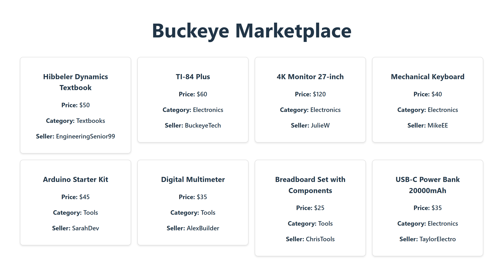
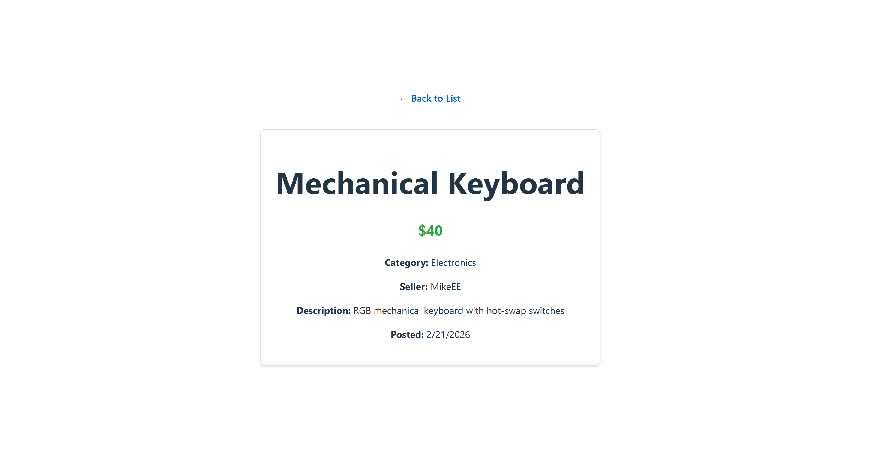

# Buckeye-Marketplace
## Feature Prioritization & Persona Mapping

The following features have been prioritized based on the needs of our primary persona, **Marcus Chen**. Marcus is a busy engineering student who values security, privacy, and efficiency.

### Phase 1: Launch (MVP - Critical Priority)
*These features address Marcus's core pain points regarding scams and privacy.*

| Feature | Issue # | Persona Justification (The "So That") |
| :--- | :--- | :--- |
| **OSU Single Sign-On (SSO)** | #52 | **So that** Marcus feels safe knowing he is trading with real students, not bots. |
| **Product Listing Creation** | #51 | **So that** Marcus can quickly list his monitor for sale with photos and details. |
| **Course-Specific Search** | #50 | **So that** Marcus can find his "Hibbeler Dynamics" book instantly without scouring. |
| **Secure In-App Messaging** | #49 | **So that** Marcus can negotiate without giving out his personal phone number. |
| **User Trust Ratings** | #48 | **So that** Marcus can verify a buyer's reputation before meeting them. |
| **Item Status Management** | #44 | **So that** Marcus doesn't waste time on items that are already sold. |
| **Shopping Cart** | #29 | **Required for Launch:** Allows Marcus to batch purchases from different sellers. |

### Phase 2: High Utility (Build Next)
*These improve the experience but aren't strictly required for the first transaction.*

| Feature | Issue # | Persona Justification |
| :--- | :--- | :--- |
| **"Safe-Swap" Scheduler** | #47 | Helps Marcus coordinate a physical meetup at a campus landmark safely. |
| **Reviews and Ratings** | #32 | **Required for Milestone:** Builds long-term community trust for Marcus. |
| **Item Condition Filtering** | #35 | Helps Marcus find "Like New" monitors specifically for his setup. |
| **"Wanted" Postings** | #45 | Allows Marcus to post an ad for a book he can't find yet. |
| **Digital Payments** | #46 | Convenient, though students may still use Venmo/Cash outside the app. |

### Phase 3: Infrastructure & Admin (Grading Requirements)
| Feature | Issue # | Reason for Priority |
| :--- | :--- | :--- |
| **Cloud Deployment** | #23 | Graded requirement to ensure the application is live and accessible. |
| **Admin Dashboard** | #34 | Necessary for site management and banning potential scammers. |

### Phase 4: Future Enhancements (Backlog)
| Feature | Issue # | Benefit to Marcus |
| :--- | :--- | :--- |
| **Favorite/Watch List** | #40 | Helps track prices of high-end engineering gear. |
| **Book Scanner (ISBN)** | #42 | Speed improvement for listing books. |
| **Low-Price Alerts** | #38 | Automated efficiency for a "Busy Student." |
| **Ticket Marketplace** | #41 | High demand, but requires separate verification logic. |
| **Guest/Parent View** | #43 | Useful for parents, but not Marcus's core goal. |
| **Accessibility Mode** | #37 | Essential for inclusivity in later versions. |
| **Campus News Feed** | #39 | General community engagement (Non-core feature). |

---
## System Architecture
This diagram illustrates the 3-tier architecture designed to solve Marcus Chen's needs for security, efficiency, and privacy.

---
## Database Entity Relationship Diagram (ERD)
This diagram illustrates the data structure for Users, Items, and Messages, ensuring a secure and organized marketplace for Marcus Chen.

## Architecture Decision Records (ADR)

### Tech Stack Selection
* **Frontend:** React.js / Next.js
    * *Why:* Allows for a responsive design that Marcus can use on his phone while walking between classes.
* **Backend:** Node.js with Express
    * *Why:* Fast and scalable for handling real-time messaging between students.
* **Database:** PostgreSQL
    * *Why:* Reliable storage for user verification data and item listings.
* **Authentication:** OSU Webauth / OpenID Connect
    * *Why:* Ensures only verified Buckeyes can log in, solving Marcus’s fear of scammers.

### AI Tool Usage
* **Tool Used:** Gemini (Google AI)
* **Purpose:** Brainstorming the 3-tier system architecture and refining the ERD to include safety features like `is_verified`.
* **Human Oversight:** All AI suggestions were manually reviewed and modified to fit the CSE 4630 Milestone 2 rubric.

---
## Component Architecture (Atomic Design)
To ensure a consistent and reusable UI for the Product Catalog, we are following Atomic Design principles.

### Atoms (Smallest functional units)
* **Button:** Red/Gray action buttons for "View Details" or "Message Seller."
* **Input Field:** Search bar text entry.
* **Badge:** Price tags and condition labels (e.g., "Like New").
* **Typography:** Specific font styles for book titles and headers.. 

### Molecules (Groups of atoms working together)
* **Search Bar:** Combines the Input atom with a Search Button atom.
* **Item Card Snippet:** Combines a book image, title atom, and price badge.
* **Filter Toggle:** Group of checkboxes for filtering by category (e.g., "CSE," "Mechanical").

### Organisms (Complex UI sections)
* **Product Grid:** A collection of Item Card molecules showing all available textbooks.
* **Navigation Bar:** The top header containing the logo, Search Bar, and User Profile link.
* **Sidebar Filter:** The section containing all category and price range Molecules.

## How to Run React App and .NET API Locally
* Backend: cd backend, then dotnet run (Listens on port 5000).
* Frontend: cd client, npm install, then npm run dev (Runs on port 5174). 
## Milestone 3 Screenshots

### Product List View

### Product Detail View

## AI Usage Summary

### Prompts
> * "Help me add a CORS policy to Program.cs for React on port 3000."
> * "Rewrite App.jsx to fetch products using useEffect/useState and create a ProductCard component with loading states."
> * "Refactor App.jsx to use react-router-dom with routes for '/' and '/product/:id', fetching from localhost:5000."
> * "Update the 'AllowReact' CORS policy to include port 5173 and 5174."

### What I Accepted
* The logic for adding multiple origins to `Program.cs`.
* The `useEffect` fetching patterns for both the list and detail views.
* The specific Markdown syntax for images containing spaces in the filenames.

### Human Oversight & Judgment
* **Verification**: I manually verified that the [Hibbeler Dynamics Textbook](http://localhost:5174/) and other 7 products were correctly pulled from the API.
* **Refinement**: I modified the CSS-in-JS styles to ensure the [Product Grid](http://localhost:5174/) was responsive and matched my Milestone 2 design.
* **Troubleshooting**: I identified that Vite was running on port 5174 and manually updated the backend policy to allow the connection.
